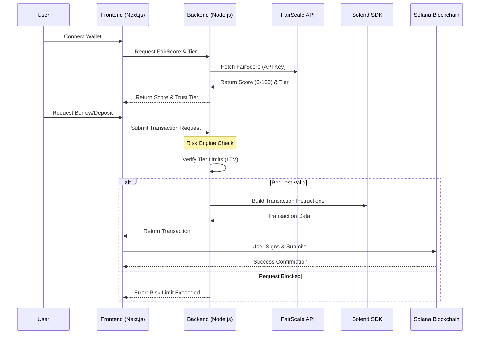

# FairLend Architecture

FairLend implements a "Risk Guardrails" architecture where a user's on-chain reputation dynamically determines their access to capital and borrowing power.

## System Flow

## Architecture Components

### 1. Frontend (Next.js 16 + Tailwind v4)
- **Role**: User Interface for connecting wallets, viewing scores, and initiating DeFi actions.
- **Key Features**:
  - Wallet connection via `@solana/wallet-adapter`.
  - Real-time FairScore display.
  - Interactive Deposit/Borrow forms.
  - Integration with Backend API for secure transaction building.

### 2. Backend (Node.js + Express)
- **Role**: The trusted "Risk Guardrail" that enforces protocol logic off-chain before building on-chain transactions.
- **Key Responsibilities**:
  - **Secure API Gateway**: Protects `FAIRSCALE_API_KEY` from client-side exposure.
  - **Risk Engine**: Intercepts every borrow request to verify if the user's FairScore meets the required threshold for the requested LTV (Loan-To-Value) ratio.
  - **Transaction Builder**: Uses the Solend SDK (or simulation fallback) to construct Solana transaction instructions only if risk checks pass.

### 3. FairScale Integration
- **Role**: Provides the "Credit Check" layer.
- **Data Flow**: The backend queries FairScale to get a user's reputation score based on their on-chain history. This score determines their "Trust Tier" (Bronze, Silver, Gold).

### 4. Solend Integration (DeFi Layer)
- **Role**: Underlying lending protocol.
- **Integration**: FairLend utilizes Solend's pools to execute actual deposits and borrows. The backend constructs the necessary instructions (SPL Token transfers, cToken minting, obligation updates) for the frontend to sign.

## Security Model
- **No Client-Side Logic for Risk**: All risk decisions happen on the backend. A user cannot simply bypass the check by modifying frontend code because the valid transaction instructions are only generated by the backend after verification.
- **Signed Attestations (Optional)**: The backend can issue a cryptographic signature (Attestation) proving a user's score, which can be verified on-chain by the Anchor program for further decentralization.
